# Thyra Architecture Diagram

```mermaid
%%{init: {'theme': 'base', 'themeVariables': { 'primaryColor': '#e1f5fe', 'primaryTextColor': '#01579b', 'primaryBorderColor': '#0288d1', 'lineColor': '#0288d1', 'secondaryColor': '#f3e5f5', 'tertiaryColor': '#e8f5e9'}}}%%

flowchart TB
    subgraph CORE["🔷 THYRA CORE - Abstract Base Classes"]
        direction TB

        subgraph ABC["Extension Contracts"]
            BMR["<b>BaseMSIReader</b><br/><i>Abstract Base Class</i><br/>━━━━━━━━━━━━━━<br/>• get_common_mass_axis()<br/>• iter_spectra()<br/>• get_essential_metadata()<br/>• get_comprehensive_metadata()"]

            BMC["<b>BaseMSIConverter</b><br/><i>Abstract Base Class</i><br/>━━━━━━━━━━━━━━<br/>• _initialize_conversion()<br/>• _create_data_structures()<br/>• _process_spectra()<br/>• _finalize_data()<br/>• _save_output()"]

            ME["<b>MetadataExtractor</b><br/><i>Abstract Base Class</i><br/>━━━━━━━━━━━━━━<br/>• get_essential()<br/>• get_comprehensive()<br/>• Two-phase extraction"]
        end

        REG["<b>Plugin Registry</b><br/>━━━━━━━━━━━━━━<br/>@register_reader('format')<br/>@register_converter('output')<br/>Auto-discovery • Thread-safe"]
    end

    subgraph READERS["📥 INPUT READERS"]
        direction TB
        IR["<b>ImzMLReader</b><br/><i>Open Standard</i><br/>━━━━━━━━━━━━<br/>.imzml + .ibd files<br/>Continuous & Processed modes<br/>pyimzML integration"]

        BR["<b>BrukerReader</b><br/><i>Proprietary Format</i><br/>━━━━━━━━━━━━<br/>.d directories<br/>TSF/TDF support<br/>SDK + SQLite integration<br/>Calibration handling"]

        FR["<b>Future Readers</b><br/><i>Community Plugins</i><br/>━━━━━━━━━━━━<br/>Thermo RAW<br/>Waters .raw<br/>SCIEX wiff<br/>..."]
    end

    subgraph METADATA["📋 METADATA EXTRACTORS"]
        direction TB
        IME["<b>ImzMLMetadataExtractor</b><br/>XML + cvParams parsing"]
        BME["<b>BrukerMetadataExtractor</b><br/>SQLite database queries"]
        FME["<b>Future Extractors</b><br/>Format-specific"]
    end

    subgraph RESAMPLING["⚙️ RESAMPLING SYSTEM"]
        direction TB
        DT["<b>Decision Tree</b><br/>Auto-strategy selection"]

        subgraph MAG["Mass Axis Generators"]
            LIN["Linear"]
            TOF["Reflector TOF"]
            FT["FTICR"]
            OT["Orbitrap"]
        end

        subgraph RS["Resampling Strategies"]
            NN["Nearest Neighbor"]
            TIC["TIC-Preserving"]
        end
    end

    subgraph CONVERTERS["📤 OUTPUT CONVERTERS"]
        direction TB
        SDC["<b>SpatialDataConverter</b><br/><i>Factory Pattern</i><br/>━━━━━━━━━━━━<br/>Auto 2D/3D selection"]

        SD2D["<b>SpatialData2DConverter</b><br/>Per-slice processing<br/>Multiple z-slices support"]

        SD3D["<b>SpatialData3DConverter</b><br/>True 3D volume<br/>Unified coordinate space"]

        FC["<b>Future Converters</b><br/><i>Community Plugins</i><br/>━━━━━━━━━━━━<br/>anndata-only<br/>OME-ZARR<br/>..."]
    end

    subgraph OUTPUT["💾 OUTPUT FORMAT"]
        direction TB
        ZARR["<b>SpatialData / Zarr</b><br/>━━━━━━━━━━━━━━<br/>☑ Cloud-native storage<br/>☑ Chunked & compressed<br/>☑ Language-agnostic<br/>☑ Standardized format"]

        subgraph COMPONENTS["Components"]
            TAB["<b>Tables</b><br/>AnnData objects<br/>Sparse matrices"]
            SHP["<b>Shapes</b><br/>GeoDataFrames<br/>Pixel boundaries"]
            IMG["<b>Images</b><br/>xarray DataArrays<br/>TIC images"]
            META["<b>Metadata</b><br/>Comprehensive dict<br/>Provenance tracking"]
        end
    end

    %% Connections
    BMR --> REG
    BMC --> REG
    ME --> REG

    REG --> IR
    REG --> BR
    REG -.-> FR

    IR --> IME
    BR --> BME
    FR -.-> FME

    IME --> DT
    BME --> DT
    FME -.-> DT

    DT --> MAG
    DT --> RS

    MAG --> SDC
    RS --> SDC

    REG --> SDC
    REG -.-> FC

    SDC --> SD2D
    SDC --> SD3D

    SD2D --> ZARR
    SD3D --> ZARR

    ZARR --> TAB
    ZARR --> SHP
    ZARR --> IMG
    ZARR --> META

    %% Styling
    classDef coreClass fill:#e3f2fd,stroke:#1565c0,stroke-width:2px,color:#0d47a1
    classDef readerClass fill:#e8f5e9,stroke:#2e7d32,stroke-width:2px,color:#1b5e20
    classDef converterClass fill:#fff3e0,stroke:#ef6c00,stroke-width:2px,color:#e65100
    classDef futureClass fill:#fafafa,stroke:#9e9e9e,stroke-width:2px,stroke-dasharray: 5 5,color:#616161
    classDef outputClass fill:#f3e5f5,stroke:#7b1fa2,stroke-width:2px,color:#4a148c
    classDef registryClass fill:#ffebee,stroke:#c62828,stroke-width:2px,color:#b71c1c
    classDef resamplingClass fill:#fffde7,stroke:#f9a825,stroke-width:2px,color:#f57f17

    class BMR,BMC,ME coreClass
    class IR,BR,IME,BME readerClass
    class SDC,SD2D,SD3D converterClass
    class FR,FME,FC futureClass
    class ZARR,TAB,SHP,IMG,META outputClass
    class REG registryClass
    class DT,LIN,TOF,FT,OT,NN,TIC resamplingClass
```



## How to Render

### Option 1: Mermaid Live Editor
1. Go to [mermaid.live](https://mermaid.live)
2. Paste the code above
3. Export as SVG or PNG

### Option 2: VS Code Extension
1. Install "Markdown Preview Mermaid Support" extension
2. Preview this file

### Option 3: Command Line
```bash
npm install -g @mermaid-js/mermaid-cli
mmdc -i architecture_diagram.md -o architecture_diagram.svg -t neutral
```

### Option 4: Python (via mermaid-py)
```python
import subprocess
# Save mermaid code to file, then:
subprocess.run(["mmdc", "-i", "diagram.mmd", "-o", "diagram.svg"])
```
