# Thyra Workflow Diagram

```mermaid
%%{init: {'theme': 'base', 'themeVariables': { 'primaryColor': '#e1f5fe', 'primaryTextColor': '#01579b', 'primaryBorderColor': '#0288d1', 'lineColor': '#424242', 'secondaryColor': '#f3e5f5', 'tertiaryColor': '#e8f5e9'}, 'flowchart': {'curve': 'basis'}}}%%

flowchart LR
    subgraph INPUT["<b>INPUT FORMATS</b>"]
        direction TB
        IMZML["📄 <b>ImzML</b><br/>.imzml + .ibd<br/><i>Open Standard</i>"]
        BRUKER["📁 <b>Bruker</b><br/>.d directory<br/><i>TSF/TDF</i>"]
        FUTURE["📦 <b>Future</b><br/><i>Community<br/>Plugins</i>"]
    end

    subgraph DETECT["<b>FORMAT<br/>DETECTION</b>"]
        direction TB
        REG["🔍 <b>Registry</b><br/>Extension-based<br/>Auto-discovery"]
    end

    subgraph READING["<b>DATA READING</b>"]
        direction TB

        subgraph READER["Reader Operations"]
            SPEC["📊 <b>iter_spectra()</b><br/>Batch processing<br/>Memory efficient"]
            AXIS["📏 <b>get_mass_axis()</b><br/>Common m/z array"]
        end

        subgraph EXTRACT["Metadata Extraction"]
            ESS["⚡ <b>Essential</b><br/>Fast extraction<br/>Dimensions, bounds"]
            COMP["📋 <b>Comprehensive</b><br/>Full metadata<br/>Instrument info"]
        end
    end

    subgraph RESAMPLE["<b>RESAMPLING</b><br/><i>(Optional)</i>"]
        direction TB
        DECISION["🌳 <b>Decision Tree</b><br/>Auto-selection"]

        subgraph MASSAXIS["Mass Axis Generation"]
            AXGEN["Linear | TOF | FTICR | Orbitrap"]
        end

        subgraph STRATEGY["Resampling Strategy"]
            STRAT["Nearest Neighbor | TIC-Preserving"]
        end
    end

    subgraph CONVERT["<b>CONVERSION</b><br/><i>Template Method</i>"]
        direction TB

        INIT["1️⃣ <b>Initialize</b><br/>Load metadata<br/>Build mass axis"]
        CREATE["2️⃣ <b>Create Structures</b><br/>Sparse matrices (COO)<br/>Pre-allocate arrays"]
        PROCESS["3️⃣ <b>Process Spectra</b><br/>m/z mapping<br/>TIC calculation"]
        FINAL["4️⃣ <b>Finalize</b><br/>COO → CSR<br/>Create AnnData"]
        SAVE["5️⃣ <b>Save Output</b><br/>Write to Zarr"]

        INIT --> CREATE --> PROCESS --> FINAL --> SAVE
    end

    subgraph OUTPUT["<b>SPATIALDATA OUTPUT</b>"]
        direction TB

        subgraph ZARR["📦 <b>.zarr Store</b>"]
            direction TB
            TABLES["📊 <b>tables/</b><br/>AnnData objects<br/>Sparse (pixels × m/z)"]
            SHAPES["🔷 <b>shapes/</b><br/>GeoDataFrames<br/>Pixel polygons"]
            IMAGES["🖼️ <b>images/</b><br/>xarray DataArrays<br/>TIC images"]
            ATTRS["📝 <b>.zattrs</b><br/>Metadata<br/>Provenance"]
        end
    end

    subgraph DOWNSTREAM["<b>DOWNSTREAM<br/>ANALYSIS</b>"]
        direction TB
        SCANPY["🔬 <b>Scanpy</b><br/>Single-cell tools"]
        SQUIDPY["🦑 <b>Squidpy</b><br/>Spatial analysis"]
        NAPARI["👁️ <b>Napari</b><br/>Visualization"]
        CUSTOM["🛠️ <b>Custom</b><br/>Python/R/Julia"]
    end

    %% Main Flow
    IMZML --> REG
    BRUKER --> REG
    FUTURE -.-> REG

    REG --> SPEC
    REG --> ESS

    SPEC --> DECISION
    AXIS --> DECISION
    ESS --> DECISION

    DECISION --> AXGEN
    DECISION --> STRAT

    AXGEN --> INIT
    STRAT --> INIT
    COMP --> FINAL

    SAVE --> TABLES
    SAVE --> SHAPES
    SAVE --> IMAGES
    SAVE --> ATTRS

    TABLES --> SCANPY
    TABLES --> SQUIDPY
    SHAPES --> SQUIDPY
    IMAGES --> NAPARI
    ZARR --> CUSTOM

    %% Styling
    classDef inputClass fill:#e8f5e9,stroke:#2e7d32,stroke-width:2px,color:#1b5e20
    classDef detectClass fill:#fff3e0,stroke:#ef6c00,stroke-width:2px,color:#e65100
    classDef readClass fill:#e3f2fd,stroke:#1565c0,stroke-width:2px,color:#0d47a1
    classDef resampleClass fill:#fffde7,stroke:#f9a825,stroke-width:2px,color:#f57f17
    classDef convertClass fill:#fce4ec,stroke:#c2185b,stroke-width:2px,color:#880e4f
    classDef outputClass fill:#f3e5f5,stroke:#7b1fa2,stroke-width:2px,color:#4a148c
    classDef downstreamClass fill:#e0f2f1,stroke:#00695c,stroke-width:2px,color:#004d40
    classDef futureClass fill:#fafafa,stroke:#9e9e9e,stroke-width:2px,stroke-dasharray: 5 5,color:#616161

    class IMZML,BRUKER inputClass
    class FUTURE futureClass
    class REG detectClass
    class SPEC,AXIS,ESS,COMP readClass
    class DECISION,AXGEN,STRAT resampleClass
    class INIT,CREATE,PROCESS,FINAL,SAVE convertClass
    class TABLES,SHAPES,IMAGES,ATTRS outputClass
    class SCANPY,SQUIDPY,NAPARI,CUSTOM downstreamClass
```

## Data Flow Description

### Stage 1: Input
- **ImzML**: Open standard XML+binary format
- **Bruker**: Proprietary .d directories with TSF/TDF files
- **Future**: Extensible for community-contributed readers

### Stage 2: Format Detection
- Registry-based automatic format detection
- Extension mapping (.imzml → ImzMLReader, .d → BrukerReader)

### Stage 3: Data Reading
- **Spectrum Iteration**: Memory-efficient batch processing
- **Mass Axis**: Build common m/z reference array
- **Metadata**: Two-phase extraction (essential for setup, comprehensive for output)

### Stage 4: Resampling (Optional)
- **Decision Tree**: Automatically selects optimal strategy based on data type
- **Mass Axis Generators**: Linear, TOF, FTICR, Orbitrap spacing options
- **Strategies**: Nearest neighbor (centroid) or TIC-preserving (profile)

### Stage 5: Conversion
1. **Initialize**: Load metadata, configure mass axis
2. **Create Structures**: Pre-allocate sparse COO matrices
3. **Process Spectra**: Map m/z values, calculate TIC, fill matrices
4. **Finalize**: Convert COO→CSR, create AnnData/GeoDataFrame objects
5. **Save**: Write SpatialData to Zarr store

### Stage 6: Output
- **Tables**: AnnData with sparse intensity matrices
- **Shapes**: Pixel boundary polygons
- **Images**: TIC images as xarray
- **Metadata**: Comprehensive provenance tracking

### Stage 7: Downstream Analysis
- Direct integration with Scanpy, Squidpy, Napari
- Cloud-native access from Python, R, Julia
